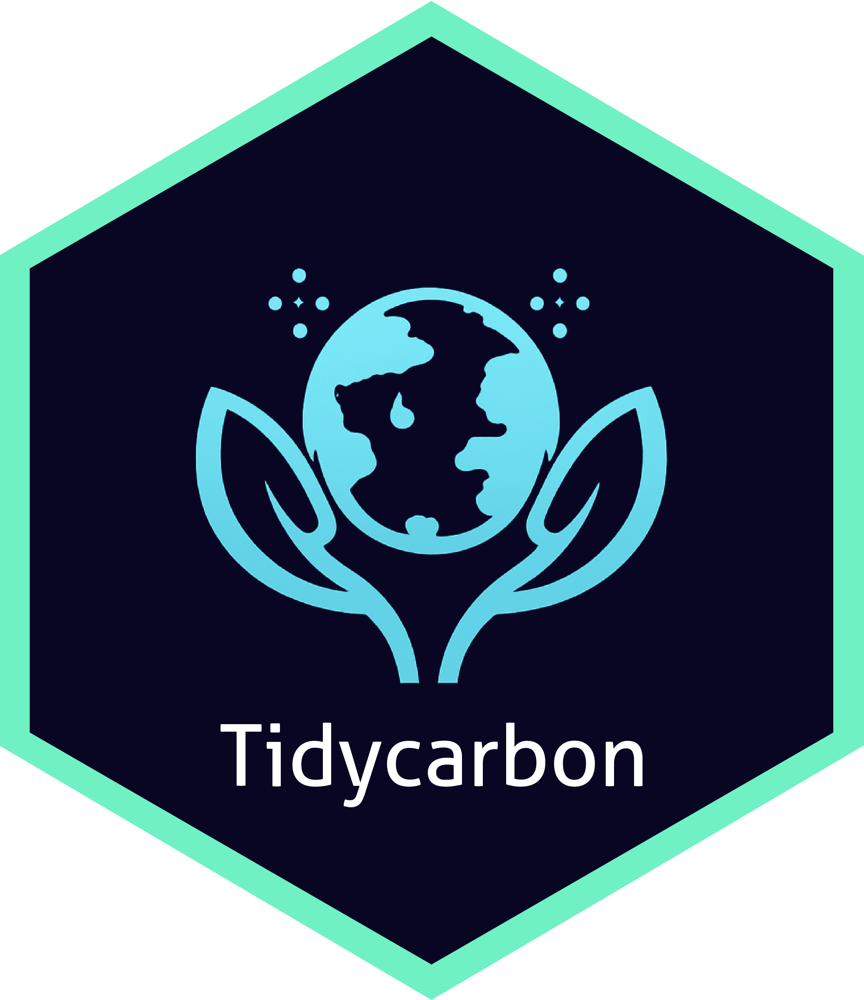

<!-- # tidycarbon  -->

<!-- badges: start -->

<!--[](https://github.com/seankellyhp/Tidycarbon/actions) -->

<!--[](https://lifecycle.r-lib.org/articles/stages.html#experimental) -->
<!-- badges: end -->

`tidycarbon` provides a minimal tidy R interface to [CodeCarbon](https://mlco2.github.io/codecarbon/), a Python library for tracking the carbon emissions and energy consumption (CPU, GPU, RAM) of computational processes. With just a few lines of code, measure the sustainability impact of your R functions, scripts, or pipelines, including detailed metrics like emissions, water use, hardware specs, and location-based carbon equivalency estimates.

## Motivations
The motivation behind `tidycarbon` is to help R users, including computational researchers and practitioners: 
1. Reduce the environmental impact of big data analyses and AI systems that disproportionately affect disadvantaged people and communities, particularly in the Global South, [learn more](https://osf.io/preprints/socarxiv/vwb5h_v1).  
2. Reduce reliance of academic researchers on third-party analytics services such as ChatGPT or Google Cloud in favor of local/private hardware and open source tools such as [Ollama](https://jbgruber.github.io/rollama/), [learn more](https://www.nature.com/articles/d41586-023-01295-4). 
3. Align with the UN Sustainable Development Goals, namely [SDG 12 (Responsible Consumption and Production)](https://sdgs.un.org/goals/goal12#targets_and_indicators) and [SDG 13 (Climate Action)](https://sdgs.un.org/goals/goal13#overview). 
4. Align with the EU AI Act (private-sector) responsibility of "reporting and documentation processes to improve AI systems resource performance, such as reducing the high-risk AI system’s consumption of energy and of other resources during its lifecycle" [(Article 40)](https://artificialintelligenceact.eu/article/40/).

This package is very much in-development and will change often. 

## Installation

Install the development version from GitHub:

```r
# install.packages("remotes")
remotes::install_github("seankellyhp/Tidycarbon")
```

`tidycarbon` relies on [reticulate](https://rstudio.github.io/reticulate/) to interface with CodeCarbon. Installation via reticulate relies on the Python uv package, and should happen automatically without any additional manual effort from you (recommended). If you prefer a manual installation (using conda or venv), refer to the reticulate docs. 

## Quickstart

### 1. Global Tracking (wrap any R code)
Think of this like time benchmarking packages such as tictok or microbenchmark. You start the tracker and you stop the tracker. Everything in between remains the same. `tidycarbon` will measure your machine on the backend.

```r
library(tidycarbon)

# First, initiate the carbon tracking engine.
tracker <- carbon_init(
  project_name = "COMPTEXT26",
  measure_power_secs = 1,
  output_file = "emissions.csv")

# Second, start the tracker.
tracker_start(tracker)

# Next, write your R code here (supports tidyverse, parallel, topicmodels, quanteda, ...everything)
library(dplyr)
iris |>
  select(Sepal.Length) |>
  pull() |>
  sum()

# Finally, stop the tracker.
tracker_stop(tracker)
```

Emissions data is automatically logged to `emissions.csv` in the root project folder. Unless otherwise specified, emissions results will always be appended to this file.

### 2. Pipeline Steps (measure each step in a pipe)
`carbon_step()` measures one step of a pipeline. After calling `carbon_init()`, drop it into any pipe by passing the step call directly --- the piped data is inserted as the call's first argument, and the session tracker is used automatically (no `tracker =` needed). Finish with `carbon_collect()` to pull the per-step log. Each step's full metrics (CO2e, energy, water, power draw, hardware, location, ...) are returned in-memory and are also appended to `emissions.csv` as a best-effort artifact.

```r
library(tidycarbon)
library(quanteda)

carbon_init(project_name = "COMPTEXT26", measure_power_secs = 1)

dfm_big <- tokens(big_corpus, remove_punct = TRUE, remove_symbols = TRUE, remove_numbers = TRUE) |>
  tokens_tolower() |>
  tokens_remove(stopwords("en")) |>
  tokens_wordstem() |>
  tidycarbon::carbon_step(tokens_ngrams(n = 1:3)) |>
  tidycarbon::carbon_step(dfm())

carbon_collect(dfm_big)   # one rich row per measured step
```

### 3. Whole-Pipeline Tracking (one window)
`carbon_run()` measures an entire expression in a single tracking window (rather than step-by-step) and returns a list with the evaluated `result` and a rich one-row `log`. Like `carbon_step()`, it uses the session tracker registered by `carbon_init()` unless you pass `tracker =`, and appends the measurement to `emissions.csv` as a best-effort artifact.

```r
library(tidycarbon)
library(quanteda)

carbon_init(project_name = "COMPTEXT26", measure_power_secs = 1)

run <- carbon_run({
  tokens(big_corpus, remove_punct = TRUE) |>
    tokens_tolower() |>
    tokens_remove(stopwords("en")) |>
    tokens_wordstem() |>
    tokens_ngrams(n = 1:3) |>
    dfm()
})

run$result   # the dfm
run$log      # one rich row: CO2e, energy, water, power, hardware, wall time
```

### 4. Benchmarking (compare alternatives)
`carbon_bench()` runs two or more named expressions repeatedly and tracks emissions for each, then `autoplot()` visualizes the comparison.

```r
library(tidycarbon)

carbon_bench(
  LLM  = rollama::query(...),
  DICT = quanteda.sentiment::textstat_polarity(txt, dictionary = LSD2015),
  times = 10) |>
  autoplot(metric = "emissions_total")
```

## Key Functions

- `carbon_init()`: Create a CodeCarbon tracker (registered as the session default).
- `tracker_start()` / `tracker_stop()`: Global run tracking.
- `carbon_step()`: Measure one pipeline step.
- `carbon_collect()`: Collect the per-step emissions log from a pipeline result.
- `carbon_run()`: Measure a whole expression in a single tracking window.
- `carbon_read()`: Read the emissions CSV log as a tibble.
- `carbon_bench()`: Benchmark and compare two or more expressions.
- `carbon_track(fun, ..., tracker)`: Track single function.
- `carbon_track_all(tasks, tracker)`: Batch track list of tasks.
- `carbon_view()`: Starts a Shiny dashboard at localhost (in development)

## Examples

See `vignettes` for more examples (in development).

## Features & Notes

- **Rich metrics**: CO2e, energy (Wh), water (L), power draw, hardware/GPU details.
- **Tidy output**: Results + emissions in one tibble.
- **Visual Dashboard**: Results are viewed from a Shiny Dashboard (in development)
- **Modern reticulate**: Auto-imports `codecarbon`.
- **Roadmap**: vignettes, website.

## Citation

Palicki, S., & Bravo, I. (2025). tidycarbon: Tidy R Wrapper for the CodeCarbon Emissions Tracker. https://github.com/seankellyhp/Tidycarbon

<!-- ## Contributing

Contributions welcome! See [CONTRIBUTING.md](https://github.com/seankellyhp/Tidycarbon/blob/main/CONTRIBUTING.md) (create if missing). --!> 
